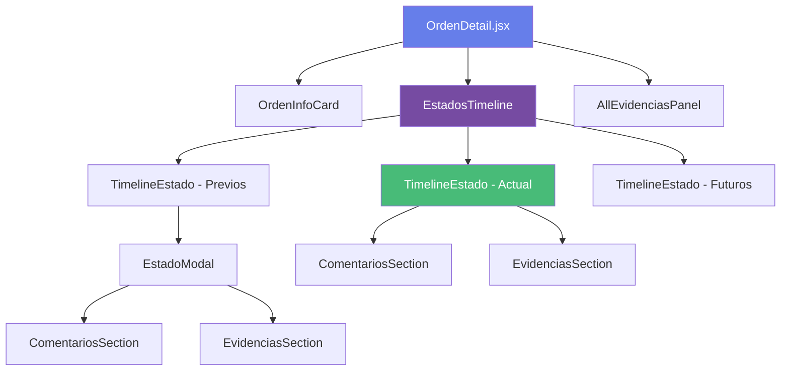
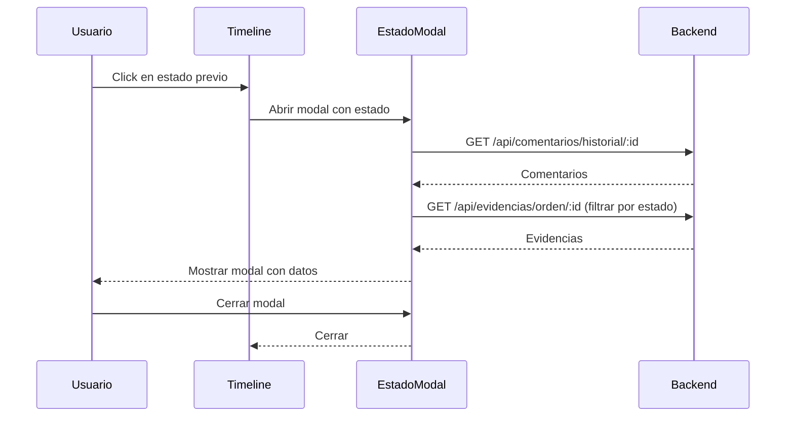
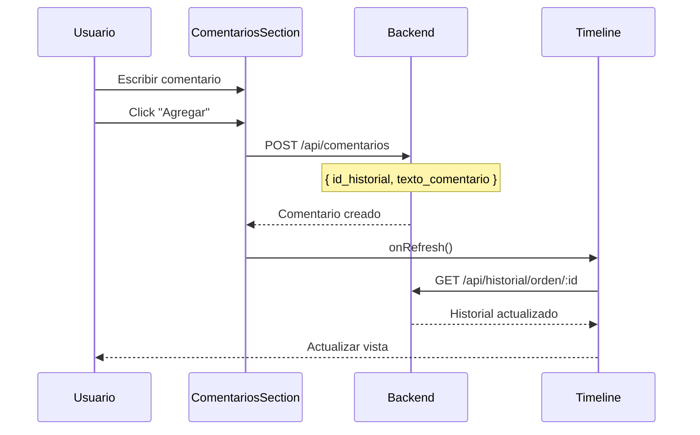
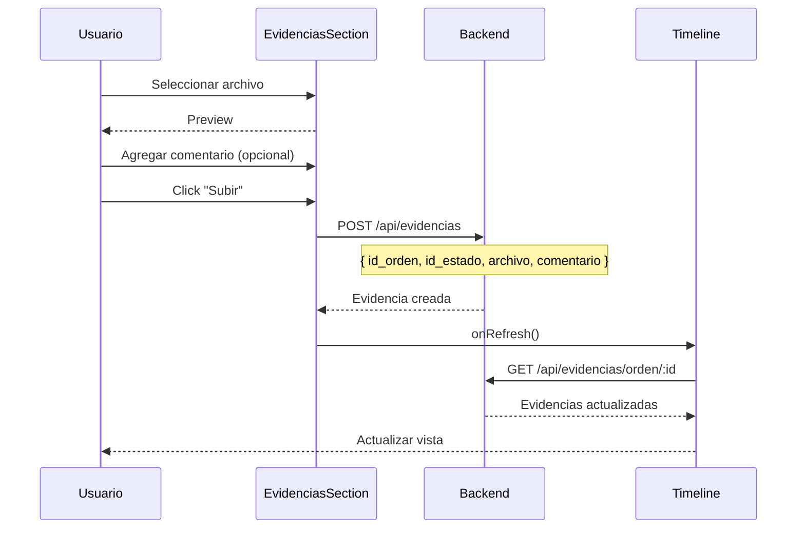
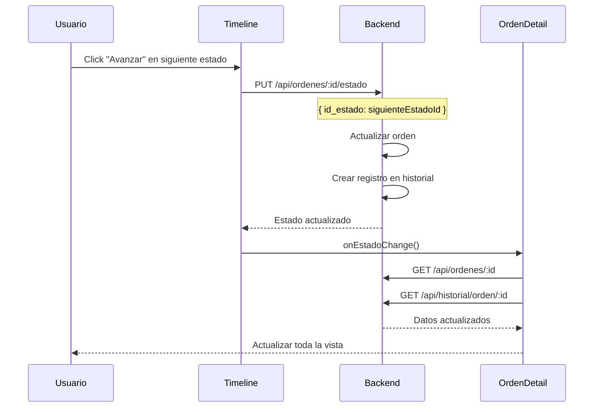

# Plan de Implementación: Vista Detallada de Orden con Línea de Tiempo

**Fecha:** 2026-01-02  
**Módulo:** Visualización de Órdenes  
**Prioridad:** Alta  
**Estado:** Planificación

---

## 📋 Resumen Ejecutivo

### Objetivo
Transformar la visualización actual de órdenes desde un modal a una página completa con una línea de tiempo interactiva que muestre el historial de estados, permitiendo gestionar comentarios y evidencias por cada estado.

### Cambio Principal
- **Antes:** Modal con toda la información de la orden
- **Después:** Página dedicada con componentes separados y línea de tiempo de estados

---

## 🎯 Requisitos Funcionales

### 1. Navegación
- Al hacer clic en "Ver" en una orden, navegar a `/orden/:id`
- Mostrar información completa de la orden en una página dedicada
- Botón de regreso a la lista de órdenes

### 2. Información Estática de la Orden
Mostrar datos que no cambian con el estado:
- Número de orden
- Cliente (nombre, contacto)
- Producto (nombre, modelo, serie)
- Flujo asignado
- Descripción del servicio
- Condiciones de pago
- Fecha de creación
- Fecha estimada de entrega
- Notas de la orden

### 3. Línea de Tiempo de Estados
Visualización horizontal con tres secciones:

#### **Estados Previos (Izquierda)**
- Estados ya completados
- Mostrar en orden cronológico
- Indicador visual de completado (✓)
- Click para ver detalles (comentarios y evidencias)

#### **Estado Actual (Centro)**
- Estado en el que se encuentra la orden
- Destacado visualmente
- Permitir agregar comentarios
- Permitir agregar evidencias
- Mostrar comentarios y evidencias existentes

#### **Estados Futuros (Derecha)**
- Estados pendientes del flujo
- Mostrar en orden secuencial
- Indicador visual de pendiente
- Botón para avanzar al siguiente estado
- No tienen historial asociado (solo estéticos)

### 4. Gestión de Comentarios y Evidencias
- **Por Estado Visitado:** Modal para ver comentarios y evidencias
- **Estado Actual:** Formulario inline para agregar nuevos
- **Evidencias Generales:** Sección separada con todas las evidencias de la orden

---

## 🗄️ Análisis de Datos

### Modelo de Datos Clave

#### **historial_estados_orden**
```prisma
model historial_estados_orden {
  id_historial           Int      @id @default(autoincrement())
  id_orden               Int
  id_estado              Int
  id_usuario_responsable Int
  fecha_hora_cambio      DateTime @default(now())
  
  // Relaciones
  comentarios_estado     comentarios_estado[]
  estados                estados
  ordenes                ordenes
  usuarios               usuarios
}
```

**Concepto Clave:** Cada vez que una orden cambia de estado, se crea un registro en `historial_estados_orden`. Este registro es el "ancla" para comentarios y evidencias de ese estado específico.

#### **comentarios_estado**
```prisma
model comentarios_estado {
  id_comentario           Int      @id @default(autoincrement())
  id_historial            Int      // FK a historial_estados_orden
  id_usuario              Int
  texto_comentario        String
  fecha_hora_comentario   DateTime @default(now())
}
```

**Relación:** Los comentarios están ligados a un registro de historial, no directamente al estado.

#### **evidencias**
```prisma
model evidencias {
  id_evidencia            Int      @id @default(autoincrement())
  id_orden                Int
  id_estado               Int      // Estado al que pertenece
  id_usuario              Int
  tipo_evidencia          String
  s3_key                  String
  nombre_archivo_original String?
  comentario              String?
  fecha_subida            DateTime @default(now())
}
```

**Relación:** Las evidencias están ligadas directamente al estado (no al historial).

---

## 🏗️ Arquitectura de Componentes

### Estructura de Archivos Frontend

```
Frontend/src/
├── pages/
│   ├── Ordenes.jsx                    (Lista de órdenes - existente)
│   └── OrdenDetail.jsx                (Nueva página de detalle)
│
├── components/
│   ├── orden/
│   │   ├── OrdenInfoCard.jsx          (Información estática)
│   │   ├── EstadosTimeline.jsx        (Línea de tiempo completa)
│   │   ├── TimelineEstado.jsx         (Componente individual de estado)
│   │   ├── EstadoModal.jsx            (Modal para ver detalles de estado)
│   │   ├── ComentariosSection.jsx     (Gestión de comentarios)
│   │   ├── EvidenciasSection.jsx      (Gestión de evidencias)
│   │   └── AllEvidenciasPanel.jsx     (Panel de todas las evidencias)
│   │
│   └── Sidebar.jsx                    (Existente)
│
└── App.jsx                            (Modificar para routing)
```

### Diagrama de Componentes



---

## 📊 Flujo de Datos

### 1. Carga Inicial de la Orden

```javascript
// GET /api/ordenes/:id
{
  "id_orden": 123,
  "id_cliente": 45,
  "id_producto": 67,
  "id_flujo": 1,
  "id_estado_actual": 3,
  "descripcion_servicio": "...",
  "condiciones_pago": "...",
  "fecha_creacion": "2026-01-01T10:00:00Z",
  "fecha_estimada_entrega": "2026-01-15T10:00:00Z",
  "notas_orden": "...",
  
  // Relaciones incluidas
  "cliente": { "nombre_completo": "...", "telefono_contacto": "..." },
  "producto": { "nombre_producto": "...", "modelo": "...", "numero_serie": "..." },
  "flujo": { "nombre_flujo": "...", "descripcion_flujo": "..." },
  "estado_actual": { "nombre_estado": "En Reparación", "descripcion_estado": "..." }
}
```

### 2. Obtener Estados del Flujo

```javascript
// GET /api/flujos/:id/estados
{
  "data": [
    { "id_estado": 1, "nombre_estado": "Recibida", "posicion": 1, "obligatorio": true },
    { "id_estado": 2, "nombre_estado": "En Diagnóstico", "posicion": 2, "obligatorio": true },
    { "id_estado": 3, "nombre_estado": "En Reparación", "posicion": 3, "obligatorio": true },
    { "id_estado": 4, "nombre_estado": "Lista", "posicion": 4, "obligatorio": true },
    { "id_estado": 5, "nombre_estado": "Entregada", "posicion": 5, "obligatorio": true }
  ]
}
```

### 3. Obtener Historial de la Orden

```javascript
// GET /api/historial/orden/:idOrden
{
  "data": [
    {
      "id_historial": 1,
      "id_orden": 123,
      "id_estado": 1,
      "id_usuario_responsable": 1,
      "fecha_hora_cambio": "2026-01-01T10:00:00Z",
      "estados": { "nombre_estado": "Recibida" },
      "usuarios": { "nombre": "Juan Pérez" },
      "comentarios_estado": [
        {
          "id_comentario": 1,
          "texto_comentario": "Orden recibida correctamente",
          "fecha_hora_comentario": "2026-01-01T10:05:00Z"
        }
      ]
    },
    {
      "id_historial": 2,
      "id_orden": 123,
      "id_estado": 2,
      "id_usuario_responsable": 1,
      "fecha_hora_cambio": "2026-01-02T09:00:00Z",
      "estados": { "nombre_estado": "En Diagnóstico" },
      "usuarios": { "nombre": "María García" },
      "comentarios_estado": [
        {
          "id_comentario": 2,
          "texto_comentario": "Diagnóstico completado, requiere cambio de pantalla",
          "fecha_hora_comentario": "2026-01-02T11:00:00Z"
        }
      ]
    },
    {
      "id_historial": 3,
      "id_orden": 123,
      "id_estado": 3,
      "id_usuario_responsable": 2,
      "fecha_hora_cambio": "2026-01-02T14:00:00Z",
      "estados": { "nombre_estado": "En Reparación" },
      "usuarios": { "nombre": "Carlos López" },
      "comentarios_estado": []
    }
  ]
}
```

### 4. Obtener Evidencias de la Orden

```javascript
// GET /api/evidencias/orden/:idOrden
{
  "data": [
    {
      "id_evidencia": 1,
      "id_orden": 123,
      "id_estado": 1,
      "tipo_evidencia": "image",
      "s3_key": "evidencias/123/foto-recepcion.jpg",
      "nombre_archivo_original": "foto-recepcion.jpg",
      "comentario": "Estado del equipo al recibir",
      "fecha_subida": "2026-01-01T10:10:00Z",
      "estados": { "nombre_estado": "Recibida" },
      "usuarios": { "nombre": "Juan Pérez" }
    },
    {
      "id_evidencia": 2,
      "id_orden": 123,
      "id_estado": 2,
      "tipo_evidencia": "image",
      "s3_key": "evidencias/123/diagnostico.jpg",
      "nombre_archivo_original": "diagnostico.jpg",
      "comentario": "Pantalla dañada",
      "fecha_subida": "2026-01-02T11:05:00Z",
      "estados": { "nombre_estado": "En Diagnóstico" },
      "usuarios": { "nombre": "María García" }
    }
  ]
}
```

---

## 🎨 Diseño de la Línea de Tiempo

### Lógica de Clasificación de Estados

```javascript
// Pseudocódigo para clasificar estados
function clasificarEstados(estadosFlujo, historial, estadoActualId) {
  const estadosPrevios = [];
  const estadoActual = null;
  const estadosFuturos = [];
  
  // Encontrar posición del estado actual
  const posicionActual = estadosFlujo.find(e => e.id_estado === estadoActualId)?.posicion;
  
  estadosFlujo.forEach(estadoFlujo => {
    // Buscar si existe en el historial
    const historialEstado = historial.find(h => h.id_estado === estadoFlujo.id_estado);
    
    if (estadoFlujo.posicion < posicionActual) {
      // Estado previo
      estadosPrevios.push({
        ...estadoFlujo,
        historial: historialEstado,
        status: 'completed',
        hasData: !!historialEstado
      });
    } else if (estadoFlujo.id_estado === estadoActualId) {
      // Estado actual
      estadoActual = {
        ...estadoFlujo,
        historial: historialEstado,
        status: 'current',
        hasData: !!historialEstado
      };
    } else {
      // Estado futuro
      estadosFuturos.push({
        ...estadoFlujo,
        historial: null,
        status: 'pending',
        hasData: false
      });
    }
  });
  
  return { estadosPrevios, estadoActual, estadosFuturos };
}
```

### Diseño Visual de la Línea de Tiempo

```
┌─────────────────────────────────────────────────────────────────────┐
│                        LÍNEA DE TIEMPO                              │
├─────────────────────────────────────────────────────────────────────┤
│                                                                     │
│  [✓] ────── [✓] ────── [●] ────── [ ] ────── [ ]                  │
│  Recibida   Diagnóstico  Reparación  Lista    Entregada            │
│  01/01      02/01        02/01       --        --                  │
│  (click)    (click)      (ACTUAL)    (avanzar) (pendiente)         │
│                                                                     │
│                          ┌─────────────────────┐                   │
│                          │  ESTADO ACTUAL      │                   │
│                          │  En Reparación      │                   │
│                          │                     │                   │
│                          │  💬 Comentarios     │                   │
│                          │  [Agregar nuevo]    │                   │
│                          │                     │                   │
│                          │  📎 Evidencias      │                   │
│                          │  [Subir archivo]    │                   │
│                          └─────────────────────┘                   │
│                                                                     │
└─────────────────────────────────────────────────────────────────────┘
```

---

## 🔧 Componentes Detallados

### 1. OrdenDetail.jsx (Página Principal)

**Responsabilidades:**
- Cargar datos de la orden
- Cargar estados del flujo
- Cargar historial de estados
- Cargar evidencias
- Coordinar componentes hijos
- Manejar navegación

**Estado Local:**
```javascript
const [orden, setOrden] = useState(null);
const [estadosFlujo, setEstadosFlujo] = useState([]);
const [historial, setHistorial] = useState([]);
const [evidencias, setEvidencias] = useState([]);
const [loading, setLoading] = useState(true);
const [error, setError] = useState(null);
```

**Endpoints Utilizados:**
- `GET /api/ordenes/:id`
- `GET /api/flujos/:id/estados`
- `GET /api/historial/orden/:idOrden`
- `GET /api/evidencias/orden/:idOrden`

---

### 2. OrdenInfoCard.jsx

**Props:**
```javascript
{
  orden: {
    id_orden,
    cliente,
    producto,
    flujo,
    descripcion_servicio,
    condiciones_pago,
    fecha_creacion,
    fecha_estimada_entrega,
    notas_orden
  }
}
```

**Diseño:**
```
┌─────────────────────────────────────────┐
│  INFORMACIÓN DE LA ORDEN #123           │
├─────────────────────────────────────────┤
│  Cliente: Juan Pérez                    │
│  Teléfono: 300-123-4567                 │
│                                         │
│  Producto: Laptop HP Pavilion 15        │
│  Modelo: eh1-xxx                        │
│  Serie: ABC123XYZ                       │
│                                         │
│  Flujo: Reparación Estándar             │
│  Descripción: Reparación de pantalla... │
│  Condiciones: 50% anticipo...           │
│                                         │
│  Creada: 01/01/2026                     │
│  Entrega estimada: 15/01/2026           │
└─────────────────────────────────────────┘
```

---

### 3. EstadosTimeline.jsx

**Props:**
```javascript
{
  estadosFlujo: Array,
  historial: Array,
  estadoActualId: Number,
  ordenId: Number,
  onEstadoChange: Function,
  onRefresh: Function
}
```

**Responsabilidades:**
- Clasificar estados (previos, actual, futuros)
- Renderizar TimelineEstado para cada uno
- Manejar clicks en estados previos
- Coordinar avance de estado

**Lógica de Renderizado:**
```javascript
const { estadosPrevios, estadoActual, estadosFuturos } = clasificarEstados(
  estadosFlujo,
  historial,
  estadoActualId
);

return (
  <div className="timeline-container">
    <div className="timeline-previos">
      {estadosPrevios.map(estado => (
        <TimelineEstado
          key={estado.id_estado}
          estado={estado}
          type="completed"
          onClick={() => handleVerEstado(estado)}
        />
      ))}
    </div>
    
    <div className="timeline-actual">
      <TimelineEstado
        estado={estadoActual}
        type="current"
        ordenId={ordenId}
        onRefresh={onRefresh}
      />
    </div>
    
    <div className="timeline-futuros">
      {estadosFuturos.map(estado => (
        <TimelineEstado
          key={estado.id_estado}
          estado={estado}
          type="pending"
          onAvanzar={() => handleAvanzarEstado(estado)}
        />
      ))}
    </div>
  </div>
);
```

---

### 4. TimelineEstado.jsx

**Props:**
```javascript
{
  estado: {
    id_estado,
    nombre_estado,
    posicion,
    historial: { ... } | null,
    status: 'completed' | 'current' | 'pending'
  },
  type: 'completed' | 'current' | 'pending',
  ordenId: Number,
  onClick: Function,
  onAvanzar: Function,
  onRefresh: Function
}
```

**Renderizado Condicional:**

**Estado Completado:**
```jsx
<div className="timeline-estado completed" onClick={onClick}>
  <div className="estado-icon">✓</div>
  <div className="estado-nombre">{nombre_estado}</div>
  <div className="estado-fecha">{formatDate(historial.fecha_hora_cambio)}</div>
</div>
```

**Estado Actual:**
```jsx
<div className="timeline-estado current">
  <div className="estado-icon">●</div>
  <div className="estado-nombre">{nombre_estado}</div>
  <div className="estado-fecha">{formatDate(historial.fecha_hora_cambio)}</div>
  
  <div className="estado-content">
    <ComentariosSection
      historialId={historial.id_historial}
      comentarios={historial.comentarios_estado}
      onRefresh={onRefresh}
    />
    
    <EvidenciasSection
      ordenId={ordenId}
      estadoId={id_estado}
      onRefresh={onRefresh}
    />
  </div>
</div>
```

**Estado Pendiente:**
```jsx
<div className="timeline-estado pending">
  <div className="estado-icon">○</div>
  <div className="estado-nombre">{nombre_estado}</div>
  <div className="estado-fecha">--</div>
  {type === 'pending' && posicion === siguientePosicion && (
    <button onClick={onAvanzar}>Avanzar</button>
  )}
</div>
```

---

### 5. EstadoModal.jsx

**Props:**
```javascript
{
  estado: {
    id_estado,
    nombre_estado,
    historial: { ... }
  },
  evidencias: Array,
  onClose: Function
}
```

**Contenido:**
- Información del estado
- Fecha y usuario del cambio
- Lista de comentarios (solo lectura)
- Lista de evidencias (solo lectura)

---

### 6. ComentariosSection.jsx

**Props:**
```javascript
{
  historialId: Number,
  comentarios: Array,
  onRefresh: Function,
  readOnly: Boolean (default: false)
}
```

**Funcionalidades:**
- Mostrar lista de comentarios existentes
- Formulario para agregar nuevo comentario (si no es readOnly)
- Editar comentario (opcional)
- Eliminar comentario (opcional)

**Endpoints:**
- `GET /api/comentarios/historial/:idHistorial`
- `POST /api/comentarios`
- `PUT /api/comentarios/:id`
- `DELETE /api/comentarios/:id`

---

### 7. EvidenciasSection.jsx

**Props:**
```javascript
{
  ordenId: Number,
  estadoId: Number,
  evidencias: Array,
  onRefresh: Function,
  readOnly: Boolean (default: false)
}
```

**Funcionalidades:**
- Mostrar evidencias del estado
- Subir nueva evidencia (si no es readOnly)
- Preview de imágenes
- Descargar archivos
- Eliminar evidencia (opcional)

**Endpoints:**
- `POST /api/evidencias`
- `DELETE /api/evidencias/:id`

---

### 8. AllEvidenciasPanel.jsx

**Props:**
```javascript
{
  evidencias: Array,
  estadosFlujo: Array
}
```

**Funcionalidades:**
- Mostrar todas las evidencias de la orden
- Agrupar por estado
- Filtrar por tipo
- Búsqueda por comentario
- Vista de galería para imágenes

---

## 🔄 Flujos de Interacción

### Flujo 1: Ver Detalles de Estado Previo



### Flujo 2: Agregar Comentario al Estado Actual



### Flujo 3: Subir Evidencia al Estado Actual



### Flujo 4: Avanzar al Siguiente Estado



---

## 🛠️ Modificaciones Necesarias

### Frontend

#### 1. Modificar App.jsx para Routing Simple

**Opción A: Sin React Router (Más simple)**
```javascript
function App() {
  const [activeView, setActiveView] = useState('dashboard');
  const [selectedOrdenId, setSelectedOrdenId] = useState(null);

  const handleVerOrden = (ordenId) => {
    setSelectedOrdenId(ordenId);
    setActiveView('orden-detail');
  };

  const handleVolverOrdenes = () => {
    setSelectedOrdenId(null);
    setActiveView('ordenes');
  };

  return (
    <div className="app-container">
      <Sidebar activeView={activeView} setActiveView={setActiveView} />
      <main className="main-content">
        {activeView === 'dashboard' && <Dashboard />}
        {activeView === 'ordenes' && <Ordenes onVerOrden={handleVerOrden} />}
        {activeView === 'orden-detail' && (
          <OrdenDetail 
            ordenId={selectedOrdenId} 
            onVolver={handleVolverOrdenes} 
          />
        )}
        {activeView === 'clientes' && <Clientes />}
        {activeView === 'productos' && <Productos />}
        {activeView === 'flujos' && <Flujos />}
      </main>
    </div>
  );
}
```

**Opción B: Con React Router (Más profesional)**
```bash
npm install react-router-dom
```

```javascript
import { BrowserRouter, Routes, Route, Navigate } from 'react-router-dom';

function App() {
  return (
    <BrowserRouter>
      <div className="app-container">
        <Sidebar />
        <main className="main-content">
          <Routes>
            <Route path="/" element={<Navigate to="/dashboard" />} />
            <Route path="/dashboard" element={<Dashboard />} />
            <Route path="/ordenes" element={<Ordenes />} />
            <Route path="/ordenes/:id" element={<OrdenDetail />} />
            <Route path="/clientes" element={<Clientes />} />
            <Route path="/productos" element={<Productos />} />
            <Route path="/flujos" element={<Flujos />} />
          </Routes>
        </main>
      </div>
    </BrowserRouter>
  );
}
```

#### 2. Modificar Ordenes.jsx

Cambiar el botón "Ver" para navegar en lugar de abrir modal:

```javascript
// Opción A (sin router)
<button 
  className="btn-sm btn-primary" 
  onClick={() => onVerOrden(orden.id_orden)}
>
  Ver
</button>

// Opción B (con router)
import { useNavigate } from 'react-router-dom';

const navigate = useNavigate();

<button 
  className="btn-sm btn-primary" 
  onClick={() => navigate(`/ordenes/${orden.id_orden}`)}
>
  Ver
</button>
```

### Backend

**No se requieren cambios en el backend.** Todos los endpoints necesarios ya existen:

✅ `GET /api/ordenes/:id` - Obtener orden completa  
✅ `GET /api/flujos/:id/estados` - Estados del flujo  
✅ `GET /api/historial/orden/:idOrden` - Historial de estados  
✅ `GET /api/evidencias/orden/:idOrden` - Evidencias de la orden  
✅ `GET /api/comentarios/historial/:idHistorial` - Comentarios de un historial  
✅ `POST /api/comentarios` - Crear comentario  
✅ `POST /api/evidencias` - Crear evidencia  
✅ `PUT /api/ordenes/:id/estado` - Cambiar estado  
✅ `DELETE /api/comentarios/:id` - Eliminar comentario  
✅ `DELETE /api/evidencias/:id` - Eliminar evidencia

---

## 📝 Estructura de Archivos a Crear

```
Frontend/src/
├── pages/
│   └── OrdenDetail.jsx                 ⭐ NUEVO
│
├── components/
│   └── orden/                          ⭐ NUEVO DIRECTORIO
│       ├── OrdenInfoCard.jsx           ⭐ NUEVO
│       ├── EstadosTimeline.jsx         ⭐ NUEVO
│       ├── TimelineEstado.jsx          ⭐ NUEVO
│       ├── EstadoModal.jsx             ⭐ NUEVO
│       ├── ComentariosSection.jsx      ⭐ NUEVO
│       ├── EvidenciasSection.jsx       ⭐ NUEVO
│       ├── AllEvidenciasPanel.jsx      ⭐ NUEVO
│       └── OrdenDetail.css             ⭐ NUEVO
│
└── App.jsx                             🔧 MODIFICAR
```

---

## 🎨 Estilos CSS Recomendados

### Paleta de Colores para Estados

```css
/* Estados */
.timeline-estado.completed {
  --estado-color: #48bb78; /* Verde */
  --estado-bg: #f0fff4;
  --esta