# Cómo Implementar RF-01: Registro Estandarizado de Órdenes

## 🎯 Objetivo

Implementar el backend necesario para permitir el registro de órdenes de servicio mediante un formulario digital que capture información del cliente, descripción del servicio, condiciones de pago y observaciones.

---

## 📊 Resumen Ejecutivo

### ¿Qué necesitas implementar?

Para cumplir con RF-01, necesitas **5 módulos CRUD completos**:

| Módulo | Propósito | Prioridad | Estado Actual |
|--------|-----------|-----------|---------------|
| **Estados** | Catálogo de estados disponibles (RF-09) | 🔴 Alta | ❌ No implementado |
| **Flujos** | Configuración de flujos de trabajo (RF-35) | 🔴 Alta | ❌ No implementado |
| **Clientes** | Gestión de clientes | 🔴 Alta | 🟡 Parcial (solo GET) |
| **Productos** | Gestión de productos/equipos | 🔴 Alta | ❌ No implementado |
| **Órdenes** | Creación y gestión de órdenes | 🔴 Alta | ❌ No implementado |

---

## 🗄️ Tablas de Base de Datos (Ya Existen)

✅ **Todas las tablas necesarias ya están en Neon:**

```
clientes              → Información de clientes
productos             → Productos/equipos de clientes
ordenes               → Órdenes de servicio
flujos                → Flujos de trabajo configurables
estados               → Catálogo de estados
flujos_estados        → Configuración de estados por flujo
historial_estados_orden → Trazabilidad de cambios
```

**No necesitas crear tablas**, solo implementar el código backend.

---

## 🏗️ Arquitectura de la Solución

### Flujo Completo de Creación de Orden

```
1. PARAMETRIZACIÓN (Configuración inicial)
   ├── Crear Estados (ej: Recibida, En Proceso, Lista, Entregada)
   └── Crear Flujo (ej: Reparación Estándar)
       └── Asignar Estados al Flujo en orden

2. DATOS BASE (Por cada orden)
   ├── Cliente (buscar existente o crear nuevo)
   └── Producto (crear producto del cliente)

3. CREAR ORDEN
   ├── Asociar Cliente + Producto
   ├── Asignar Flujo activo
   ├── Establecer Estado inicial (primer estado del flujo)
   ├── Capturar descripción servicio
   ├── Capturar condiciones de pago
   └── Registrar en historial
```

### Diagrama Visual

```mermaid
graph LR
    A[1. Configurar Estados] --> B[2. Configurar Flujo]
    B --> C[3. Asignar Estados a Flujo]
    C --> D[4. Registrar Cliente]
    D --> E[5. Registrar Producto]
    E --> F[6. Crear Orden]
    F --> G[7. Historial Inicial]
    
    style A fill:#E53E3E,color:#fff
    style B fill:#E53E3E,color:#fff
    style C fill:#E53E3E,color:#fff
    style D fill:#48BB78,color:#fff
    style E fill:#48BB78,color:#fff
    style F fill:#4299E1,color:#fff
    style G fill:#4299E1,color:#fff
```



---

## 📦 Módulos a Implementar

### 1️⃣ Módulo Estados (RF-09)

**¿Para qué sirve?**  
Gestionar el catálogo maestro de estados que pueden usarse en cualquier flujo.

**Endpoints necesarios:**
```
GET    /api/estados           → Listar todos los estados
GET    /api/estados/:id       → Obtener un estado
POST   /api/estados           → Crear nuevo estado
PUT    /api/estados/:id       → Actualizar estado
DELETE /api/estados/:id       → Eliminar estado
```

**Ejemplo de uso:**
```bash
# Crear estado "Recibida"
POST /api/estados
{
  "nombre_estado": "Recibida",
  "descripcion_estado": "Orden recibida en el sistema"
}

# Crear estado "En Diagnóstico"
POST /api/estados
{
  "nombre_estado": "En Diagnóstico",
  "descripcion_estado": "Equipo en proceso de diagnóstico"
}
```

**Archivos a crear:**
```
backend/domain/entities/Estado.js
backend/domain/repositories/IEstadoRepository.js
backend/infrastructure/repositories/EstadoRepository.js
backend/application/usecases/estado/
  ├── GetEstadosUseCase.js
  ├── CreateEstadoUseCase.js
  ├── UpdateEstadoUseCase.js
  └── DeleteEstadoUseCase.js
backend/presentation/controllers/EstadoController.js
backend/presentation/routes/estado.routes.js
```

**Validaciones importantes:**
- ✅ Nombres únicos
- ✅ No eliminar si está en uso en flujos activos

---

### 2️⃣ Módulo Flujos (RF-35)

**¿Para qué sirve?**  
Configurar flujos de trabajo parametrizables que definen el proceso que seguirán las órdenes.

**Endpoints necesarios:**
```
GET    /api/flujos                → Listar flujos
GET    /api/flujos/:id            → Obtener flujo con estados
POST   /api/flujos                → Crear flujo
PUT    /api/flujos/:id            → Actualizar flujo
PUT    /api/flujos/:id/estados    → Configurar estados del flujo
DELETE /api/flujos/:id            → Eliminar flujo
```

**Ejemplo de uso:**
```bash
# 1. Crear flujo
POST /api/flujos
{
  "nombre_flujo": "Reparación Estándar",
  "descripcion_flujo": "Flujo para reparaciones comunes",
  "activo": true
}

# 2. Configurar estados del flujo
PUT /api/flujos/1/estados
{
  "estados": [
    { "id_estado": 1, "posicion": 1, "obligatorio": true },   // Recibida
    { "id_estado": 2, "posicion": 2, "obligatorio": true },   // En Diagnóstico
    { "id_estado": 3, "posicion": 3, "obligatorio": true },   // En Reparación
    { "id_estado": 4, "posicion": 4, "obligatorio": true },   // Lista
    { "id_estado": 5, "posicion": 5, "obligatorio": true }    // Entregada
  ]
}
```

**Archivos a crear:**
```
backend/domain/entities/Flujo.js
backend/domain/entities/FlujoEstado.js
backend/domain/repositories/IFlujoRepository.js
backend/infrastructure/repositories/FlujoRepository.js
backend/application/usecases/flujo/
  ├── GetFlujosUseCase.js
  ├── CreateFlujoUseCase.js
  ├── UpdateFlujoUseCase.js
  └── ConfigurarEstadosFlujoUseCase.js
backend/presentation/controllers/FlujoController.js
backend/presentation/routes/flujo.routes.js
```

**Validaciones importantes:**
- ✅ Mínimo 3 estados por flujo
- ✅ Máximo recomendado: 7 estados
- ✅ Al menos un flujo activo en el sistema

---

### 3️⃣ Módulo Clientes (Completar)

**¿Para qué sirve?**  
Gestionar información de clientes que solicitan servicios.

**Estado actual:** ✅ Repositorio existe, ❌ Solo GET /api/clientes implementado

**Endpoints a agregar:**
```
GET    /api/clientes/:id          → Obtener cliente por ID
POST   /api/clientes              → Crear cliente
PUT    /api/clientes/:id          → Actualizar cliente
DELETE /api/clientes/:id          → Eliminar cliente
GET    /api/clientes/buscar?q=    → Buscar cliente
```

**Ejemplo de uso:**
```bash
POST /api/clientes
{
  "tipo_identificacion": "CC",
  "numero_identificacion": "1234567890",
  "nombre_completo": "Juan Pérez",
  "telefono_contacto": "3001234567",
  "correo_electronico": "juan@example.com",
  "tipo_direccion": "Residencial",
  "direccion": "Calle 123 #45-67",
  "notas_cliente": "Cliente frecuente"
}
```

**Archivos a crear/modificar:**
```
backend/application/usecases/cliente/
  ├── CreateClienteUseCase.js      (nuevo)
  ├── UpdateClienteUseCase.js      (nuevo)
  ├── DeleteClienteUseCase.js      (nuevo)
  └── SearchClienteUseCase.js      (nuevo)
backend/presentation/controllers/ClienteController.js  (modificar)
backend/presentation/routes/cliente.routes.js          (modificar)
```

**Validaciones importantes:**
- ✅ Email único
- ✅ Combinación tipo+número identificación única

---

### 4️⃣ Módulo Productos

**¿Para qué sirve?**  
Registrar productos/equipos de clientes que ingresan para servicio.

**Endpoints necesarios:**
```
GET    /api/productos                    → Listar productos
GET    /api/productos/:id                → Obtener producto
GET    /api/productos/cliente/:idCliente → Productos de un cliente
POST   /api/productos                    → Crear producto
PUT    /api/productos/:id                → Actualizar producto
DELETE /api/productos/:id                → Eliminar producto
```

**Ejemplo de uso:**
```bash
POST /api/productos
{
  "id_cliente": 123,
  "nombre_producto": "Laptop HP Pavilion 15",
  "identificador_interno": "LAP-001",
  "descripcion": "Laptop para reparación de pantalla",
  "modelo": "Pavilion 15-eh1xxx",
  "numero_serie": "5CD1234ABC",
  "notas_producto": "Incluye cargador original"
}
```

**Archivos a crear:**
```
backend/domain/entities/Producto.js
backend/domain/repositories/IProductoRepository.js
backend/infrastructure/repositories/ProductoRepository.js
backend/application/usecases/producto/
  ├── GetProductosUseCase.js
  ├── GetProductosByClienteUseCase.js
  ├── CreateProductoUseCase.js
  └── UpdateProductoUseCase.js
backend/presentation/controllers/ProductoController.js
backend/presentation/routes/producto.routes.js
```

**Validaciones importantes:**
- ✅ Cliente debe existir
- ✅ Nombre producto requerido

---

### 5️⃣ Módulo Órdenes (RF-01) ⭐

**¿Para qué sirve?**  
Crear y gestionar órdenes de servicio (objetivo principal del RF-01).

**Endpoints necesarios:**
```
GET    /api/ordenes                  → Listar órdenes
GET    /api/ordenes/:id              → Obtener orden completa
POST   /api/ordenes                  → Crear orden ⭐
PUT    /api/ordenes/:id              → Actualizar orden
PUT    /api/ordenes/:id/estado       → Cambiar estado
GET    /api/ordenes/cliente/:id      → Órdenes de cliente
GET    /api/ordenes/estado/:id       → Órdenes por estado
```

**Ejemplo de uso (RF-01):**
```bash
POST /api/ordenes
{
  "cliente": {
    "id_cliente": 123  // Si existe
    // O crear nuevo:
    // "tipo_identificacion": "CC",
    // "numero_identificacion": "1234567890",
    // "nombre_completo": "Juan Pérez",
    // ...
  },
  "producto": {
    "nombre_producto": "Laptop HP Pavilion 15",
    "modelo": "Pavilion 15-eh1xxx",
    "numero_serie": "5CD1234ABC",
    "descripcion": "Laptop para reparación"
  },
  "orden": {
    "descripcion_servicio": "Reparación de pantalla y teclado",
    "condiciones_pago": "50% anticipo, 50% contra entrega",
    "fecha_estimada_entrega": "2025-01-15T10:00:00Z",
    "notas_orden": "Cliente requiere urgencia"
  },
  "id_flujo": 1
}
```

**Archivos a crear:**
```
backend/domain/entities/Orden.js
backend/domain/repositories/IOrdenRepository.js
backend/infrastructure/repositories/OrdenRepository.js
backend/infrastructure/repositories/HistorialEstadoRepository.js
backend/application/usecases/orden/
  ├── GetOrdenesUseCase.js
  ├── GetOrdenByIdUseCase.js
  ├── CreateOrdenUseCase.js              ⭐ Principal
  ├── UpdateOrdenUseCase.js
  └── CambiarEstadoOrdenUseCase.js
backend/presentation/controllers/OrdenController.js
backend/presentation/routes/orden.routes.js
```

**Lógica especial:**
1. Validar/crear cliente
2. Crear producto asociado al cliente
3. Obtener flujo activo y su primer estado
4. Crear orden con estado inicial
5. Registrar en historial_estados_orden

---

## 🔄 Orden de Implementación

### Fase 1: Parametrización (Días 1-2)
```
1. Implementar Módulo Estados
   └── CRUD completo + validaciones

2. Implementar Módulo Flujos
   └── CRUD + configuración de estados
```

**¿Por qué primero?**  
Porque necesitas tener estados y flujos configurados antes de crear órdenes.

### Fase 2: Datos Base (Días 3-4)
```
3. Completar Módulo Clientes
   └── Agregar POST, PUT, DELETE

4. Implementar Módulo Productos
   └── CRUD completo
```

**¿Por qué después?**  
Porque las órdenes necesitan clientes y productos.

### Fase 3: Órdenes (Días 5-7)
```
5. Implementar Módulo Órdenes
   ├── Creación de orden (RF-01)
   ├── Cambio de estado
   ├── Validaciones de flujo
   └── Historial de estados
```

**¿Por qué al final?**  
Porque depende de todos los módulos anteriores.

---

## 🎯 Lógica de Parametrización

### Concepto Clave

El sistema separa:
1. **Catálogo de Estados** (qué estados existen)
2. **Flujos de Trabajo** (cómo se usan los estados)

Esto permite que cada negocio adapte su proceso sin cambiar código.

### Ejemplo Práctico

**Catálogo de Estados (RF-09):**
```
1. Recibida
2. En Diagnóstico
3. Esperando Repuestos
4. En Reparación
5. En Pruebas
6. Lista para Entrega
7. Entregada
8. Cerrada
```

**Flujo "Reparación Rápida":**
```
Posición 1: Recibida (obligatorio)
Posición 2: En Reparación (obligatorio)
Posición 3: Lista para Entrega (obligatorio)
Posición 4: Entregada (obligatorio)
```

**Flujo "Reparación Compleja":**
```
Posición 1: Recibida (obligatorio)
Posición 2: En Diagnóstico (obligatorio)
Posición 3: Esperando Repuestos (opcional)
Posición 4: En Reparación (obligatorio)
Posición 5: En Pruebas (obligatorio)
Posición 6: Lista para Entrega (obligatorio)
Posición 7: Entregada (obligatorio)
```

### Validación de Transiciones

```javascript
// No se pueden saltar estados obligatorios
Estado actual: "Recibida" (posición 1)
Intentar cambiar a: "Lista para Entrega" (posición 6)
❌ ERROR: No se puede saltar "En Diagnóstico" (obligatorio)

// Transición válida
Estado actual: "Recibida" (posición 1)
Cambiar a: "En Diagnóstico" (posición 2)
✅ OK: Transición permitida
```

---

## 📝 Estructura de Archivos por Módulo

Cada módulo sigue Clean Architecture:

```
Módulo [Nombre]
├── Domain Layer
│   ├── entities/[Nombre].js              → Entidad de negocio
│   └── repositories/I[Nombre]Repository.js → Interfaz
│
├── Infrastructure Layer
│   └── repositories/[Nombre]Repository.js → Implementación con Prisma
│
├── Application Layer
│   └── usecases/[nombre]/
│       ├── Get[Nombre]sUseCase.js
│       ├── Create[Nombre]UseCase.js
│       ├── Update[Nombre]UseCase.js
│       └── Delete[Nombre]UseCase.js
│
└── Presentation Layer
    ├── controllers/[Nombre]Controller.js  → Lógica de endpoints
    └── routes/[nombre].routes.js          → Definición de rutas
```

---

## ✅ Checklist de Implementación

### Estados
- [ ] Crear entidad Estado
- [ ] Crear interfaz IEstadoRepository
- [ ] Implementar EstadoRepository con Prisma
- [ ] Crear GetEstadosUseCase
- [ ] Crear CreateEstadoUseCase
- [ ] Crear UpdateEstadoUseCase
- [ ] Crear DeleteEstadoUseCase (con validación)
- [ ] Crear EstadoController
- [ ] Crear estado.routes.js
- [ ] Registrar rutas en index.js
- [ ] Probar endpoints

### Flujos
- [ ] Crear entidad Flujo
- [ ] Crear entidad FlujoEstado
- [ ] Crear interfaz IFlujoRepository
- [ ] Implementar FlujoRepository con Prisma
- [ ] Crear GetFlujosUseCase
- [ ] Crear CreateFlujoUseCase
- [ ] Crear UpdateFlujoUseCase
- [ ] Crear ConfigurarEstadosFlujoUseCase
- [ ] Crear FlujoController
- [ ] Crear flujo.routes.js
- [ ] Registrar rutas en index.js
- [ ] Probar endpoints

### Clientes (Completar)
- [ ] Crear CreateClienteUseCase
- [ ] Crear UpdateClienteUseCase
- [ ] Crear DeleteClienteUseCase
- [ ] Crear SearchClienteUseCase
- [ ] Actualizar ClienteController
- [ ] Actualizar cliente.routes.js
- [ ] Probar nuevos endpoints

### Productos
- [ ] Crear entidad Producto
- [ ] Crear interfaz IProductoRepository
- [ ] Implementar ProductoRepository con Prisma
- [ ] Crear GetProductosUseCase
- [ ] Crear GetProductosByClienteUseCase
- [ ] Crear CreateProductoUseCase
- [ ] Crear UpdateProductoUseCase
- [ ] Crear ProductoController
- [ ] Crear producto.routes.js
- [ ] Registrar rutas en index.js
- [ ] Probar endpoints

### Órdenes (RF-01)
- [ ] Crear entidad Orden
- [ ] Crear interfaz IOrdenRepository
- [ ] Implementar OrdenRepository con Prisma
- [ ] Implementar HistorialEstadoRepository
- [ ] Crear GetOrdenesUseCase
- [ ] Crear GetOrdenByIdUseCase
- [ ] Crear CreateOrdenUseCase ⭐
- [ ] Crear UpdateOrdenUseCase
- [ ] Crear CambiarEstadoOrdenUseCase
- [ ] Crear OrdenController
- [ ] Crear orden.routes.js
- [ ] Registrar rutas en index.js
- [ ] Probar creación de orden completa

---

## 🧪 Cómo Probar

### 1. Configurar Estados
```bash
POST /api/estados {"nombre_estado": "Recibida", ...}
POST /api/estados {"nombre_estado": "En Proceso", ...}
POST /api/estados {"nombre_estado": "Lista", ...}
POST /api/estados {"nombre_estado": "Entregada", ...}
```

### 2. Configurar Flujo
```bash
POST /api/flujos {"nombre_flujo": "Reparación Estándar", ...}
PUT /api/flujos/1/estados {estados: [...]}
```

### 3. Crear Cliente
```bash
POST /api/clientes {nombre_completo: "Juan Pérez", ...}
```

### 4. Crear Orden (RF-01)
```bash
POST /api/ordenes {
  cliente: {id_cliente: 1},
  producto: {nombre_producto: "Laptop HP", ...},
  orden: {descripcion_servicio: "Reparación", ...},
  id_flujo: 1
}
```

### 5. Verificar
```bash
GET /api/ordenes/1  # Ver orden completa con relaciones
```

---

## 📚 Recursos

- **Plan Detallado:** [`RF-01-REGISTRO-ORDENES.md`](./RF-01-REGISTRO-ORDENES.md)
- **Modelos Prisma:** [`../prisma/MODELS_SUMMARY.md`](../prisma/MODELS_SUMMARY.md)
- **Ejemplo Repositorio:** [`../backend/infrastructure/repositories/ClienteRepository.js`](../backend/infrastructure/repositories/ClienteRepository.js)

---

## 🎯 Criterio de Aceptación RF-01

✅ **Se considera cumplido cuando:**

1. Se puede crear una orden desde API
2. Se captura información del cliente (nuevo o existente)
3. Se captura información del producto
4. Se captura descripción del servicio
5. Se capturan condiciones de pago
6. Se capturan observaciones
7. La orden se asigna a un flujo activo
8. La orden inicia en el primer estado del flujo
9. Se registra en historial el cambio inicial
10. Todas las validaciones funcionan correctamente

---

**Creado:** 2025-12-24  
**Autor:** Arquitecto del Sistema  
**Estado:** Listo para implementación
