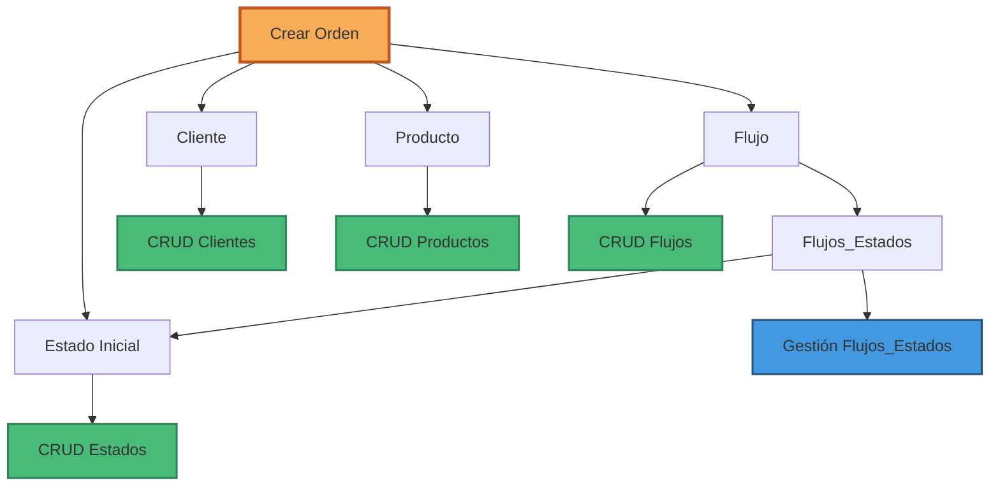
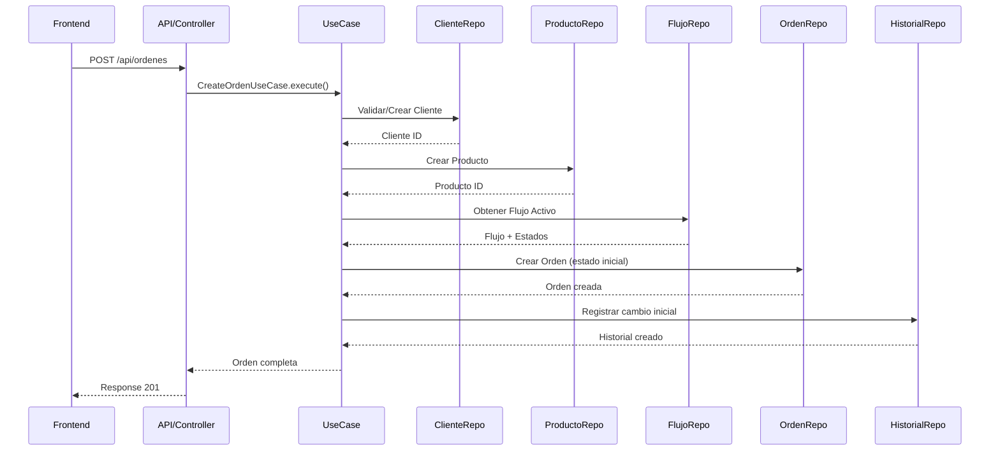

# RF-01: Registro Estandarizado de Órdenes - Plan de Implementación Backend

**Módulo:** MÓDULO 1 – Registro y creación de órdenes  
**Requisito:** RF-01 - Registro estandarizado de órdenes  
**Prioridad:** Alta  
**Fecha:** 2025-12-24

---

## 📋 Análisis del Requisito

### Descripción
El sistema debe permitir registrar una orden de servicio mediante un formulario digital que capture:
- Información básica del cliente (nombre, contacto)
- Descripción del servicio
- Condiciones de pago
- Observaciones

### Criterio de Aceptación
✅ El sistema permite crear una orden desde la interfaz web con todos los campos requeridos y validaciones obligatorias.

---

## 🗄️ Análisis de Tablas Necesarias

### Tablas Principales (Ya existen en Neon)

#### 1. **clientes** ✅
```prisma
model clientes {
  id_cliente            Int     @id @default(autoincrement())
  tipo_identificacion   String  @db.VarChar(20)
  numero_identificacion String  @db.VarChar(50)
  nombre_completo       String  @db.VarChar(255)
  telefono_contacto     String  @db.VarChar(50)
  correo_electronico    String  @unique @db.VarChar(255)
  tipo_direccion        String? @db.VarChar(50)
  direccion             String?
  notas_cliente         String?
}
```
**Uso:** Almacenar información del cliente asociado a la orden.

#### 2. **productos** ✅
```prisma
model productos {
  id_producto                   Int     @id @default(autoincrement())
  id_cliente                    Int
  nombre_producto               String  @db.VarChar(255)
  identificador_interno         String? @db.VarChar(100)
  descripcion                   String?
  modelo                        String? @db.VarChar(100)
  numero_serie                  String? @db.VarChar(100)
  identificador_unico_adicional String? @db.VarChar(100)
  notas_producto                String?
}
```
**Uso:** Registrar el producto/equipo que ingresa para servicio.

#### 3. **ordenes** ✅
```prisma
model ordenes {
  id_orden                Int       @id @default(autoincrement())
  id_cliente              Int
  id_producto             Int
  id_flujo                Int
  id_estado_actual        Int
  descripcion_servicio    String?
  condiciones_pago        String?
  fecha_creacion          DateTime  @default(now())
  fecha_estimada_entrega  DateTime?
  fecha_cierre            DateTime?
  notas_orden             String?
}
```
**Uso:** Orden de servicio principal con toda la información.

#### 4. **flujos** ✅
```prisma
model flujos {
  id_flujo          Int     @id @default(autoincrement())
  nombre_flujo      String  @unique @db.VarChar(100)
  descripcion_flujo String?
  activo            Boolean @default(true)
}
```
**Uso:** Define el flujo de trabajo que seguirá la orden.

#### 5. **estados** ✅
```prisma
model estados {
  id_estado          Int     @id @default(autoincrement())
  nombre_estado      String  @unique @db.VarChar(100)
  descripcion_estado String?
}
```
**Uso:** Catálogo de estados disponibles en el sistema.

#### 6. **flujos_estados** ✅
```prisma
model flujos_estados {
  id_flujo    Int
  id_estado   Int
  posicion    Int
  obligatorio Boolean @default(true)
  
  @@id([id_flujo, posicion])
}
```
**Uso:** Define qué estados componen cada flujo y en qué orden.

#### 7. **historial_estados_orden** ✅
```prisma
model historial_estados_orden {
  id_historial           Int      @id @default(autoincrement())
  id_orden               Int
  id_estado              Int
  id_usuario_responsable Int
  fecha_hora_cambio      DateTime @default(now())
}
```
**Uso:** Trazabilidad de cambios de estado de la orden.

---

## ✅ Confirmación de Análisis

**Tu entendimiento es CORRECTO:**

Para cumplir con RF-01 necesitas implementar CRUD completo de:
1. ✅ **Clientes** - Para registrar/buscar clientes
2. ✅ **Productos** - Para registrar productos del cliente
3. ✅ **Estados** - Para gestionar catálogo de estados (RF-09)
4. ✅ **Flujos** - Para configurar flujos de trabajo (RF-35)
5. ✅ **Flujos_Estados** - Para parametrizar flujos
6. ✅ **Órdenes** - Para crear la orden de servicio

---

## 🏗️ Arquitectura de Solución

### Diagrama de Dependencias



### Flujo de Creación de Orden



---

## 📦 Módulos a Implementar

### Prioridad 1: Módulos Base (Parametrización)

#### 1.1 Módulo Estados (RF-09)
**Propósito:** Gestionar catálogo maestro de estados

**Endpoints:**
- `GET /api/estados` - Listar todos los estados
- `GET /api/estados/:id` - Obtener estado por ID
- `POST /api/estados` - Crear nuevo estado
- `PUT /api/estados/:id` - Actualizar estado
- `DELETE /api/estados/:id` - Eliminar estado (validar uso)

**Validaciones:**
- Nombre único
- No eliminar si está en uso en flujos activos
- Descripción opcional

**Archivos a crear:**
```
backend/domain/entities/Estado.js
backend/domain/repositories/IEstadoRepository.js
backend/infrastructure/repositories/EstadoRepository.js
backend/application/usecases/estado/GetEstadosUseCase.js
backend/application/usecases/estado/CreateEstadoUseCase.js
backend/application/usecases/estado/UpdateEstadoUseCase.js
backend/application/usecases/estado/DeleteEstadoUseCase.js
backend/presentation/controllers/EstadoController.js
backend/presentation/routes/estado.routes.js
```

#### 1.2 Módulo Flujos (RF-35)
**Propósito:** Gestionar flujos de trabajo parametrizables

**Endpoints:**
- `GET /api/flujos` - Listar flujos
- `GET /api/flujos/:id` - Obtener flujo con estados
- `POST /api/flujos` - Crear flujo
- `PUT /api/flujos/:id` - Actualizar flujo
- `DELETE /api/flujos/:id` - Eliminar flujo
- `PUT /api/flujos/:id/estados` - Configurar estados del flujo

**Validaciones:**
- Nombre único
- Mínimo 3 estados (inicio, proceso, fin)
- Máximo recomendado: 7 estados
- Al menos un flujo activo en el sistema

**Archivos a crear:**
```
backend/domain/entities/Flujo.js
backend/domain/entities/FlujoEstado.js
backend/domain/repositories/IFlujoRepository.js
backend/infrastructure/repositories/FlujoRepository.js
backend/application/usecases/flujo/GetFlujosUseCase.js
backend/application/usecases/flujo/CreateFlujoUseCase.js
backend/application/usecases/flujo/UpdateFlujoUseCase.js
backend/application/usecases/flujo/ConfigurarEstadosFlujoUseCase.js
backend/presentation/controllers/FlujoController.js
backend/presentation/routes/flujo.routes.js
```

### Prioridad 2: Módulos de Datos

#### 2.1 Módulo Clientes (Completar)
**Estado actual:** Repositorio existe, falta exponer endpoints

**Endpoints a agregar:**
- `GET /api/clientes/:id` - Obtener cliente por ID
- `POST /api/clientes` - Crear cliente
- `PUT /api/clientes/:id` - Actualizar cliente
- `DELETE /api/clientes/:id` - Eliminar cliente
- `GET /api/clientes/buscar?q=` - Buscar por nombre/email/identificación

**Validaciones:**
- Email único
- Combinación tipo+número identificación única
- Teléfono y email requeridos

**Archivos a crear/modificar:**
```
backend/application/usecases/cliente/CreateClienteUseCase.js
backend/application/usecases/cliente/UpdateClienteUseCase.js
backend/application/usecases/cliente/DeleteClienteUseCase.js
backend/application/usecases/cliente/SearchClienteUseCase.js
backend/presentation/controllers/ClienteController.js (modificar)
backend/presentation/routes/cliente.routes.js (modificar)
```

#### 2.2 Módulo Productos
**Propósito:** Gestionar productos/equipos de clientes

**Endpoints:**
- `GET /api/productos` - Listar productos
- `GET /api/productos/:id` - Obtener producto
- `GET /api/productos/cliente/:idCliente` - Productos de un cliente
- `POST /api/productos` - Crear producto
- `PUT /api/productos/:id` - Actualizar producto
- `DELETE /api/productos/:id` - Eliminar producto

**Validaciones:**
- Cliente debe existir
- Nombre producto requerido
- Identificadores opcionales pero útiles

**Archivos a crear:**
```
backend/domain/entities/Producto.js
backend/domain/repositories/IProductoRepository.js
backend/infrastructure/repositories/ProductoRepository.js
backend/application/usecases/producto/GetProductosUseCase.js
backend/application/usecases/producto/GetProductosByClienteUseCase.js
backend/application/usecases/producto/CreateProductoUseCase.js
backend/application/usecases/producto/UpdateProductoUseCase.js
backend/presentation/controllers/ProductoController.js
backend/presentation/routes/producto.routes.js
```

### Prioridad 3: Módulo Principal

#### 3.1 Módulo Órdenes (RF-01)
**Propósito:** Crear y gestionar órdenes de servicio

**Endpoints:**
- `GET /api/ordenes` - Listar órdenes (con filtros)
- `GET /api/ordenes/:id` - Obtener orden completa
- `POST /api/ordenes` - Crear orden
- `PUT /api/ordenes/:id` - Actualizar orden
- `PUT /api/ordenes/:id/estado` - Cambiar estado
- `GET /api/ordenes/cliente/:idCliente` - Órdenes de cliente
- `GET /api/ordenes/estado/:idEstado` - Órdenes por estado

**Validaciones:**
- Cliente debe existir o crearse
- Producto debe existir o crearse
- Flujo debe estar activo
- Estado inicial debe ser el primero del flujo
- Descripción servicio requerida

**Lógica especial:**
- Al crear orden, registrar en historial_estados_orden
- Validar transiciones de estado según flujo
- No permitir saltar estados obligatorios

**Archivos a crear:**
```
backend/domain/entities/Orden.js
backend/domain/repositories/IOrdenRepository.js
backend/infrastructure/repositories/OrdenRepository.js
backend/infrastructure/repositories/HistorialEstadoRepository.js
backend/application/usecases/orden/GetOrdenesUseCase.js
backend/application/usecases/orden/GetOrdenByIdUseCase.js
backend/application/usecases/orden/CreateOrdenUseCase.js
backend/application/usecases/orden/UpdateOrdenUseCase.js
backend/application/usecases/orden/CambiarEstadoOrdenUseCase.js
backend/presentation/controllers/OrdenController.js
backend/presentation/routes/orden.routes.js
```

---

## 🎯 Lógica de Parametrización Implementada

### 10.4.1 Catálogo de Estados (RF-09)

**Implementación:**

```javascript
// EstadoRepository.js
class EstadoRepository {
  async findAll() {
    return await prisma.estados.findMany({
      orderBy: { nombre_estado: 'asc' }
    });
  }

  async create(data) {
    // Validar nombre único
    const existe = await prisma.estados.findUnique({
      where: { nombre_estado: data.nombre_estado }
    });
    
    if (existe) {
      throw new Error('Ya existe un estado con ese nombre');
    }
    
    return await prisma.estados.create({ data });
  }

  async delete(id) {
    // Validar que no esté en uso
    const enUso = await prisma.flujos_estados.findFirst({
      where: { id_estado: id }
    });
    
    if (enUso) {
      throw new Error('No se puede eliminar: estado en uso en flujos activos');
    }
    
    return await prisma.estados.delete({
      where: { id_estado: id }
    });
  }
}
```

### 10.4.2 Construcción de Flujos (RF-35)

**Implementación:**

```javascript
// FlujoRepository.js
class FlujoRepository {
  async configurarEstados(idFlujo, estados) {
    // estados = [{ id_estado, posicion, obligatorio }]
    
    // Validar mínimo 3 estados
    if (estados.length < 3) {
      throw new Error('El flujo debe tener al menos 3 estados');
    }
    
    // Validar máximo recomendado
    if (estados.length > 7) {
      console.warn('Se recomienda máximo 7 estados para simplicidad');
    }
    
    // Eliminar configuración anterior
    await prisma.flujos_estados.deleteMany({
      where: { id_flujo: idFlujo }
    });
    
    // Crear nueva configuración
    const configuraciones = estados.map((estado, index) => ({
      id_flujo: idFlujo,
      id_estado: estado.id_estado,
      posicion: index + 1,
      obligatorio: estado.obligatorio ?? true
    }));
    
    return await prisma.flujos_estados.createMany({
      data: configuraciones
    });
  }

  async getEstadosFlujo(idFlujo) {
    return await prisma.flujos_estados.findMany({
      where: { id_flujo: idFlujo },
      include: { estados: true },
      orderBy: { posicion: 'asc' }
    });
  }
}
```

### Validación de Transiciones de Estado

```javascript
// CambiarEstadoOrdenUseCase.js
class CambiarEstadoOrdenUseCase {
  async execute(idOrden, nuevoEstadoId, usuarioId) {
    // 1. Obtener orden actual
    const orden = await ordenRepo.findById(idOrden);
    
    // 2. Obtener flujo y sus estados
    const estadosFlujo = await flujoRepo.getEstadosFlujo(orden.id_flujo);
    
    // 3. Validar transición
    const estadoActualPos = estadosFlujo.find(
      e => e.id_estado === orden.id_estado_actual
    )?.posicion;
    
    const nuevoEstadoPos = estadosFlujo.find(
      e => e.id_estado === nuevoEstadoId
    )?.posicion;
    
    // 4. Verificar que no se salten estados obligatorios
    const estadosIntermedios = estadosFlujo.filter(
      e => e.posicion > estadoActualPos && 
           e.posicion < nuevoEstadoPos &&
           e.obligatorio
    );
    
    if (estadosIntermedios.length > 0) {
      throw new Error('No se pueden saltar estados obligatorios');
    }
    
    // 5. Actualizar orden
    await ordenRepo.update(idOrden, {
      id_estado_actual: nuevoEstadoId
    });
    
    // 6. Registrar en historial
    await historialRepo.create({
      id_orden: idOrden,
      id_estado: nuevoEstadoId,
      id_usuario_responsable: usuarioId,
      fecha_hora_cambio: new Date()
    });
    
    return true;
  }
}
```

---

## 📝 Estructura de Request/Response

### POST /api/ordenes - Crear Orden

**Request Body:**
```json
{
  "cliente": {
    "id_cliente": 123,  // Si existe
    // O crear nuevo:
    "tipo_identificacion": "CC",
    "numero_identificacion": "1234567890",
    "nombre_completo": "Juan Pérez",
    "telefono_contacto": "3001234567",
    "correo_electronico": "juan@example.com"
  },
  "producto": {
    "nombre_producto": "Laptop HP",
    "modelo": "Pavilion 15",
    "numero_serie": "ABC123XYZ",
    "descripcion": "Laptop para reparación"
  },
  "orden": {
    "descripcion_servicio": "Reparación de pantalla y teclado",
    "condiciones_pago": "50% anticipo, 50% contra entrega",
    "fecha_estimada_entrega": "2025-01-15T10:00:00Z",
    "notas_orden": "Cliente requiere urgencia"
  },
  "id_flujo": 1  // Flujo activo a usar
}
```

**Response 201:**
```json
{
  "success": true,
  "message": "Orden creada exitosamente",
  "data": {
    "id_orden": 456,
    "id_cliente": 123,
    "id_producto": 789,
    "id_flujo": 1,
    "id_estado_actual": 1,
    "descripcion_servicio": "Reparación de pantalla y teclado",
    "condiciones_pago": "50% anticipo, 50% contra entrega",
    "fecha_creacion": "2025-12-24T17:00:00Z",
    "fecha_estimada_entrega": "2025-01-15T10:00:00Z",
    "notas_orden": "Cliente requiere urgencia",
    "cliente": {
      "nombre_completo": "Juan Pérez",
      "telefono_contacto": "3001234567"
    },
    "producto": {
      "nombre_producto": "Laptop HP",
      "modelo": "Pavilion 15"
    },
    "estado_actual": {
      "nombre_estado": "Recibida",
      "descripcion_estado": "Orden recibida en el sistema"
    },
    "flujo": {
      "nombre_flujo": "Reparación Estándar",
      "estados": [
        { "posicion": 1, "nombre_estado": "Recibida", "obligatorio": true },
        { "posicion": 2, "nombre_estado": "En Diagnóstico", "obligatorio": true },
        { "posicion": 3, "nombre_estado": "En Reparación", "obligatorio": true },
        { "posicion": 4, "nombre_estado": "Lista", "obligatorio": true },
        { "posicion": 5, "nombre_estado": "Entregada", "obligatorio": true }
      ]
    }
  }
}
```

---

## 🔄 Orden de Implementación Recomendado

### Fase 1: Parametrización (1-2 días)
1. ✅ Módulo Estados (CRUD completo)
2. ✅ Módulo Flujos (CRUD + configuración)
3. ✅ Validaciones de parametrización

### Fase 2: Datos Base (1-2 días)
4. ✅ Completar Módulo Clientes (endpoints faltantes)
5. ✅ Módulo Productos (CRUD completo)

### Fase 3: Órdenes (2-3 días)
6. ✅ Módulo Órdenes (creación básica)
7. ✅ Lógica de cambio de estado
8. ✅ Validaciones de flujo
9. ✅ Historial de estados

### Fase 4: Testing y Refinamiento (1 día)
10. ✅ Pruebas de integración
11. ✅ Validaciones completas
12. ✅ Documentación de API

---

## 📊 Checklist de Implementación

### Estados (RF-09)
- [ ] Entidad Estado
- [ ] Repositorio Estado
- [ ] UseCase: GetEstados
- [ ] UseCase: CreateEstado
- [ ] UseCase: UpdateEstado
- [ ] UseCase: DeleteEstado (con validación)
- [ ] Controller Estado
- [ ] Routes Estado
- [ ] Validación nombres únicos
- [ ] Validación no eliminar si en uso

### Flujos (RF-35)
- [ ] Entidad Flujo
- [ ] Entidad FlujoEstado
- [ ] Repositorio Flujo
- [ ] UseCase: GetFlujos
- [ ] UseCase: CreateFlujo
- [ ] UseCase: UpdateFlujo
- [ ] UseCase: ConfigurarEstadosFlujo
- [ ] Controller Flujo
- [ ] Routes Flujo
- [ ] Validación mínimo 3 estados
- [ ] Validación al menos 1 flujo activo

### Clientes (Completar)
- [ ] UseCase: CreateCliente
- [ ] UseCase: UpdateCliente
- [ ] UseCase: DeleteCliente
- [ ] UseCase: SearchCliente
- [ ] Actualizar Controller
- [ ] Actualizar Routes
- [ ] Validación email único
- [ ] Validación identificación única

### Productos
- [ ] Entidad Producto
- [ ] Repositorio Producto
- [ ] UseCase: GetProductos
- [ ] UseCase: GetProductosByCliente
- [ ] UseCase: CreateProducto
- [ ] UseCase: UpdateProducto
- [ ] Controller Producto
- [ ] Routes Producto
- [ ] Validación cliente existe

### Órdenes (RF-01)
- [ ] Entidad Orden
- [ ] Repositorio Orden
- [ ] Repositorio HistorialEstado
- [ ] UseCase: GetOrdenes
- [ ] UseCase: GetOrdenById
- [ ] UseCase: CreateOrden
- [ ] UseCase: UpdateOrden
- [ ] UseCase: CambiarEstadoOrden
- [ ] Controller Orden
- [ ] Routes Orden
- [ ] Validación flujo activo
- [ ] Validación estado inicial
- [ ] Validación transiciones
- [ ] Registro en historial

---

## 🎯 Criterios de Aceptación RF-01

### ✅ Funcionales
- [ ] Se puede crear una orden desde API
- [ ] Se captura información del cliente (nuevo o existente)
- [ ] Se captura información del producto
- [ ] Se captura descripción del servicio
- [ ] Se capturan condiciones de pago
- [ ] Se capturan observaciones/notas
- [ ] La orden se asigna a un flujo activo
- [ ] La orden inicia en el primer estado del flujo
- [ ] Se registra en historial el estado inicial

### ✅ Validaciones
- [ ] Campos requeridos validados
- [ ] Email único en clientes
- [ ] Identificación única en clientes
- [ ] Flujo debe estar activo
- [ ] Estado inicial debe existir en flujo
- [ ] Producto asociado a cliente correcto

### ✅ Técnicos
- [ ] Respeta Clean Architecture
- [ ] Usa Prisma ORM
- [ ] Manejo de errores apropiado
- [ ] Códigos HTTP correctos
- [ ] Respuestas JSON estandarizadas
- [ ] Logging de operaciones

---

## 📚 Recursos y Referencias

### Documentación Relacionada
- [`prisma/schema.prisma`](../prisma/schema.prisma) - Modelos de datos
- [`prisma/MODELS_SUMMARY.md`](../prisma/MODELS_SUMMARY.md) - Resumen de modelos
- [`backend/infrastructure/repositories/ClienteRepository.js`](../backend/infrastructure/repositories/ClienteRepository.js) - Ejemplo de repositorio

### Patrones a Seguir
- Clean Architecture (capas bien definidas)
- Repository Pattern (acceso a datos)
- Use Case Pattern (lógica de negocio)
- DTO Pattern (transferencia de datos)

### Convenciones
- Nombres en español para entidades de negocio
- snake_case en base de datos
- camelCase en código JavaScript
- Prefijo `I` para interfaces de repositorio

---

## 🚀 Próximos Pasos

1. **Revisar y aprobar este plan**
2. **Crear rama de desarrollo:** `feature/rf-01-registro-ordenes`
3. **Implementar en orden:** Estados → Flujos → Clientes → Productos → Órdenes
4. **Testing continuo** de cada módulo
5. **Documentar API** con ejemplos de uso
6. **Code review** antes de merge

---

**Documento creado:** 2025-12-24  
**Última actualización:** 2025-12-24  
**Estado:** Pendiente de aprobación
