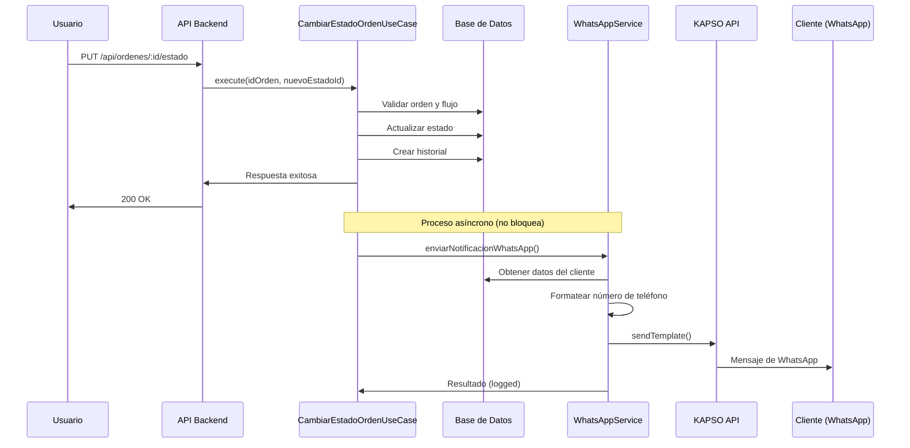

# Implementación de Notificaciones WhatsApp con KAPSO

## Resumen

Se ha integrado exitosamente el servicio de notificaciones de WhatsApp usando KAPSO API para enviar actualizaciones automáticas a los clientes cuando cambia el estado de sus órdenes.

## Componentes Implementados

### 1. Servicio WhatsApp
**Archivo**: [`backend/infrastructure/services/WhatsAppService.js`](../backend/infrastructure/services/WhatsAppService.js)

**Responsabilidades**:
- Gestionar la comunicación con KAPSO API
- Formatear números de teléfono al formato internacional
- Enviar notificaciones de cambio de estado
- Enviar mensajes de texto simples
- Crear templates en KAPSO

**Métodos principales**:
- `isConfigured()` - Verifica si el servicio está configurado
- `formatPhoneNumber(telefono)` - Formatea números al formato +57XXXXXXXXXX
- `notifyStatusChange(cliente, orden, nuevoEstado)` - Envía notificación de cambio de estado
- `sendTextMessage(to, body)` - Envía mensaje de texto simple
- `sendTemplate(to, templateName, parameters)` - Envía template genérico
- `createTemplate(templateData)` - Crea un template en KAPSO

### 2. Integración en Use Case
**Archivo**: [`backend/application/usecases/orden/CambiarEstadoOrdenUseCase.js`](../backend/application/usecases/orden/CambiarEstadoOrdenUseCase.js)

**Cambios realizados**:
- Importación de `WhatsAppService` y `ClienteRepository`
- Método `enviarNotificacionWhatsApp()` que se ejecuta de forma asíncrona
- Llamada no bloqueante después de cambiar el estado
- Manejo de errores que no afecta el flujo principal

### 3. Variables de Entorno
**Archivos**: [`.env`](../.env), [`.env.example`](../.env.example)

```env
# KAPSO WhatsApp Configuration
KAPSO_API_KEY=a5e07437ebe35fe68c3764dd80fde1281779ca5fc1baaa500f686c00cd2c8513
KAPSO_BASE_URL=https://api.kapso.ai/meta/whatsapp
KAPSO_PHONE_NUMBER_ID=867029193169302
KAPSO_BUSINESS_ACCOUNT_ID=2112611499275414
WHATSAPP_NOTIFICATIONS_ENABLED=true
```

### 4. Templates de WhatsApp
**Documentación**: [`plans/WHATSAPP-TEMPLATES.md`](./WHATSAPP-TEMPLATES.md)

Templates creados:
1. `cambio_estado_orden` - Notificación genérica de cambio de estado
2. `orden_creada` - Confirmación de creación de orden
3. `orden_completada` - Notificación de orden completada
4. `orden_en_proceso` - Notificación de orden en proceso

### 5. Script de Creación de Templates
**Archivo**: [`backend/scripts/createWhatsAppTemplates.js`](../backend/scripts/createWhatsAppTemplates.js)

**Uso**:
```bash
node backend/scripts/createWhatsAppTemplates.js
```

Este script crea automáticamente todos los templates necesarios en KAPSO.

## Flujo de Funcionamiento



## Características Implementadas

### ✅ Notificaciones Automáticas
- Se envía automáticamente una notificación cuando cambia el estado de una orden
- El cliente recibe un mensaje con su nombre, número de orden y nuevo estado

### ✅ Formato de Números
- Soporte para múltiples formatos de entrada
- Conversión automática al formato internacional (+57XXXXXXXXXX)
- Validación de números de teléfono

### ✅ Manejo de Errores Robusto
- Los errores de WhatsApp no afectan el cambio de estado
- Logging detallado de éxitos y fallos
- Manejo de casos edge (cliente sin teléfono, servicio deshabilitado, etc.)

### ✅ Configuración Flexible
- Servicio puede habilitarse/deshabilitarse con variable de entorno
- Soporte para múltiples templates
- Fácil extensión para nuevos tipos de notificaciones

### ✅ No Bloqueante
- El envío de WhatsApp se ejecuta de forma asíncrona
- No aumenta significativamente el tiempo de respuesta del API
- Usa `.catch()` para evitar promesas no manejadas

## Configuración de Cuenta KAPSO

### Datos de la Cuenta
- **Business Account ID**: 2112611499275414
- **Phone Number ID**: 867029193169302
- **Número de WhatsApp**: +57 316 6651673
- **API Key**: Configurada en variables de entorno

### Proceso de Aprobación de Templates
1. Ejecutar script de creación de templates
2. Meta revisa los templates (24-48 horas)
3. Una vez aprobados, se pueden usar para enviar mensajes
4. Verificar estado en dashboard de KAPSO o Meta Business Manager

## Uso

### Habilitar/Deshabilitar Notificaciones
```env
# Habilitar
WHATSAPP_NOTIFICATIONS_ENABLED=true

# Deshabilitar (útil en desarrollo)
WHATSAPP_NOTIFICATIONS_ENABLED=false
```

### Enviar Notificación Manual
```javascript
import WhatsAppService from './backend/infrastructure/services/WhatsAppService.js';

// Mensaje de texto simple
await WhatsAppService.sendTextMessage(
  '+573166651673',
  'Hola, este es un mensaje de prueba'
);

// Usando template
await WhatsAppService.sendTemplate(
  '+573166651673',
  'cambio_estado_orden',
  [
    { type: 'text', parameterName: 'cliente_nombre', text: 'Juan Pérez' },
    { type: 'text', parameterName: 'orden_numero', text: '#123' },
    { type: 'text', parameterName: 'nuevo_estado', text: 'En Proceso' }
  ]
);
```

### Crear Templates
```bash
# Ejecutar script de creación
node backend/scripts/createWhatsAppTemplates.js

# Verificar resultado
# ✅ Templates creados exitosamente
# ⏳ Esperar aprobación de Meta (24-48 horas)
```

## Testing

Ver plan completo de testing en: [`plans/WHATSAPP-TESTING-PLAN.md`](./WHATSAPP-TESTING-PLAN.md)

### Test Rápido
```bash
# 1. Verificar configuración
node -e "const WS = require('./backend/infrastructure/services/WhatsAppService').default; console.log('Configurado:', WS.isConfigured());"

# 2. Enviar mensaje de prueba
node -e "const WS = require('./backend/infrastructure/services/WhatsAppService').default; WS.sendTextMessage('+573166651673', 'Test desde Fluxe').then(r => console.log(r));"

# 3. Cambiar estado de orden (desde API o frontend)
# PUT /api/ordenes/1/estado
# Body: { "nuevoEstadoId": 2, "usuarioId": 1 }
```

## Logs y Monitoreo

### Logs de Éxito
```
✅ Notificación WhatsApp enviada a Juan Pérez (+573166651673)
```

### Logs de Advertencia
```
⚠️ No se envió notificación WhatsApp: no_phone_number
⚠️ No se envió notificación WhatsApp: service_disabled
```

### Logs de Error
```
❌ Error enviando notificación WhatsApp (no crítico): Template not found
```

## Consideraciones Importantes

### Políticas de WhatsApp
- ✅ Usar categoría UTILITY para notificaciones transaccionales
- ✅ Templates deben ser aprobados por Meta
- ✅ Respetar límites de rate según tier de cuenta
- ✅ Solo enviar mensajes relevantes y esperados

### Seguridad
- ✅ API Key almacenada en variables de entorno
- ✅ No exponer credenciales en el frontend
- ✅ Validar números de teléfono antes de enviar

### Rendimiento
- ✅ Envío asíncrono no bloquea el flujo principal
- ✅ Errores de WhatsApp no afectan cambios de estado
- ✅ Timeout implícito en llamadas HTTP

### Costos
- ⚠️ Verificar pricing de KAPSO por mensaje
- ⚠️ Monitorear cantidad de mensajes enviados
- ⚠️ Implementar límites si es necesario

## Próximas Mejoras (Opcional)

### Funcionalidades Adicionales
1. **Tabla de Logs de Notificaciones**
   - Registrar en BD cada notificación enviada
   - Incluir: timestamp, destinatario, template, resultado

2. **Retry Logic**
   - Reintentar envíos fallidos
   - Cola de mensajes pendientes

3. **Templates Dinámicos**
   - Diferentes templates según el tipo de estado
   - Personalización por cliente

4. **Dashboard de Notificaciones**
   - Ver historial de notificaciones enviadas
   - Estadísticas de entrega
   - Gestión de opt-in/opt-out

5. **Webhooks de KAPSO**
   - Recibir confirmaciones de entrega
   - Actualizar estado de notificaciones

## Soporte y Troubleshooting

### Problema: No se reciben mensajes
1. Verificar que `WHATSAPP_NOTIFICATIONS_ENABLED=true`
2. Verificar que el template está aprobado por Meta
3. Revisar formato del número de teléfono
4. Verificar logs del servidor

### Problema: Error "Template not found"
1. Ejecutar script de creación de templates
2. Esperar aprobación de Meta (24-48 horas)
3. Verificar nombre del template en el código

### Problema: Error "Invalid phone number"
1. Verificar que el número incluye código de país
2. Usar formato internacional: +57XXXXXXXXXX
3. Verificar que el número es válido en WhatsApp

## Referencias

- **Documentación KAPSO**: https://docs.kapso.ai/llms.txt
- **WhatsApp Business API**: https://developers.facebook.com/docs/whatsapp
- **Templates**: [`plans/WHATSAPP-TEMPLATES.md`](./WHATSAPP-TEMPLATES.md)
- **Testing**: [`plans/WHATSAPP-TESTING-PLAN.md`](./WHATSAPP-TESTING-PLAN.md)

## Resumen de Archivos Modificados/Creados

### Archivos Creados
- ✅ [`backend/infrastructure/services/WhatsAppService.js`](../backend/infrastructure/services/WhatsAppService.js)
- ✅ [`backend/scripts/createWhatsAppTemplates.js`](../backend/scripts/createWhatsAppTemplates.js)
- ✅ [`plans/WHATSAPP-TEMPLATES.md`](./WHATSAPP-TEMPLATES.md)
- ✅ [`plans/WHATSAPP-TESTING-PLAN.md`](./WHATSAPP-TESTING-PLAN.md)
- ✅ [`plans/WHATSAPP-IMPLEMENTATION.md`](./WHATSAPP-IMPLEMENTATION.md)

### Archivos Modificados
- ✅ [`.env`](../.env) - Agregadas variables de KAPSO
- ✅ [`.env.example`](../.env.example) - Agregadas variables de KAPSO
- ✅ [`backend/application/usecases/orden/CambiarEstadoOrdenUseCase.js`](../backend/application/usecases/orden/CambiarEstadoOrdenUseCase.js) - Integración de notificaciones
- ✅ [`package.json`](../package.json) - Agregada dependencia @kapso/whatsapp-cloud-api

### Dependencias Instaladas
- ✅ `@kapso/whatsapp-cloud-api` - SDK oficial de KAPSO

---

**Implementación completada el**: 2026-01-05  
**Versión**: 1.0.0  
**Estado**: ✅ Listo para testing
