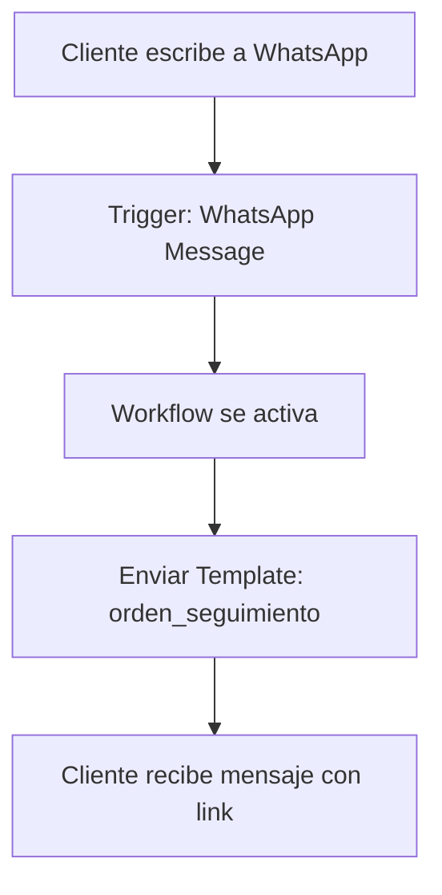

# Workflow de Bienvenida Automática - WhatsApp

## Objetivo

Crear un workflow en KAPSO que responda automáticamente cuando un cliente escriba por WhatsApp, enviándole un template con información sobre cómo seguir su orden.

## Flujo del Workflow



## Template Requerido

### Nombre: `orden_seguimiento`

**Categoría**: UTILITY

**Idioma**: es_MX

**Texto**:
```
Hola, en este momento estamos trabajando en tu orden. En este link {{link}} podrás ver comentarios, evidencias y el flujo de cómo va la orden. Cualquier actualización que se realice te la enviaremos por este canal.
```

**Parámetros**:
- `link` - URL para seguimiento de la orden (placeholder por ahora)

**Ejemplo**:
```
Hola, en este momento estamos trabajando en tu orden. En este link https://fluxe.app/orden/ABC123 podrás ver comentarios, evidencias y el flujo de cómo va la orden. Cualquier actualización que se realice te la enviaremos por este canal.
```

## Configuración del Workflow en KAPSO

### 1. Crear el Template

Primero necesitamos crear el template en KAPSO:

```javascript
// Script: backend/scripts/createWelcomeTemplate.js
{
  name: 'orden_seguimiento',
  category: 'UTILITY',
  language: 'es_MX',
  parameterFormat: 'NAMED',
  components: [
    {
      type: 'BODY',
      text: 'Hola, en este momento estamos trabajando en tu orden. En este link {{link}} podrás ver comentarios, evidencias y el flujo de cómo va la orden. Cualquier actualización que se realice te la enviaremos por este canal.',
      example: {
        body_text_named_params: [
          { 
            param_name: 'link', 
            example: 'https://fluxe.app/orden/ABC123' 
          }
        ]
      }
    }
  ]
}
```

### 2. Crear el Workflow en Dashboard de KAPSO

**Pasos en la interfaz web de KAPSO**:

1. **Ir a Workflows** → "Create New Workflow"

2. **Configurar Trigger**:
   - Tipo: "WhatsApp Message Trigger"
   - WhatsApp Number: Seleccionar tu número (867029193169302)
   - Activar: ✅

3. **Agregar Step: Send Template**:
   - Tipo: "Send Template Message"
   - Template: `orden_seguimiento`
   - To: `{{context.phone_number}}` (número del cliente que escribió)
   - Parámetros:
     - `link`: `https://fluxe.app/orden/PLACEHOLDER` (por ahora)

4. **Guardar y Activar** el workflow

### 3. Variables Disponibles en el Workflow

Cuando el workflow se ejecuta, tienes acceso a:

```javascript
// Información del cliente
{{context.phone_number}}       // Número del cliente que escribió
{{last_user_input}}           // El mensaje que envió
{{context.conversation_id}}   // ID de la conversación

// Información del sistema
{{system.trigger_type}}       // "inbound_message"
{{system.workflow_id}}        // ID del workflow
```

## Implementación Paso a Paso

### Paso 1: Crear el Template

```bash
# Ejecutar script para crear el template
node backend/scripts/createWelcomeTemplate.js
```

### Paso 2: Configurar Workflow en KAPSO Dashboard

1. Acceder a: https://app.kapso.ai (o el dashboard correspondiente)
2. Ir a sección "Workflows"
3. Click en "Create Workflow"
4. Configurar según las especificaciones arriba

### Paso 3: Probar el Workflow

1. Enviar un mensaje de WhatsApp al número: +57 316 6651673
2. Verificar que recibes la respuesta automática
3. Confirmar que el template se envía correctamente

## Configuración del Workflow (JSON)

Si KAPSO permite importar workflows vía JSON o API:

```json
{
  "name": "Bienvenida Automática",
  "description": "Responde automáticamente cuando un cliente escribe",
  "trigger": {
    "type": "whatsapp_message",
    "whatsapp_config_id": "867029193169302"
  },
  "steps": [
    {
      "type": "send_template",
      "template_name": "orden_seguimiento",
      "to": "{{context.phone_number}}",
      "parameters": [
        {
          "type": "text",
          "parameter_name": "link",
          "text": "https://fluxe.app/orden/PLACEHOLDER"
        }
      ]
    }
  ]
}
```

## Mejoras Futuras

### Fase 2: Link Dinámico con ID de Orden

Cuando implementemos la página de seguimiento:

1. **Crear endpoint para obtener orden por cliente**:
   ```javascript
   GET /api/ordenes/cliente/:telefono/ultima
   // Retorna la última orden del cliente
   ```

2. **Modificar workflow para incluir ID real**:
   ```javascript
   // En lugar de PLACEHOLDER, usar:
   https://fluxe.app/seguimiento/{{orden_id}}
   ```

3. **Crear página de seguimiento**:
   - Ruta: `/seguimiento/:ordenId`
   - Muestra: Comentarios, evidencias, timeline de estados
   - Similar a OrdenDetail pero pública (sin autenticación)

### Fase 3: Workflow Inteligente

Agregar lógica condicional:

```javascript
// Si el cliente ya tiene una orden activa
if (tiene_orden_activa) {
  enviar_template_con_link_real()
} else {
  enviar_template_bienvenida_general()
}
```

## Consideraciones Importantes

### Limitaciones de WhatsApp Business API

1. **Ventana de 24 horas**: 
   - Después de que el cliente escribe, tienes 24 horas para responder con mensajes libres
   - Fuera de esa ventana, solo puedes usar templates aprobados

2. **Templates requieren aprobación**:
   - El template `orden_seguimiento` debe ser aprobado por Meta
   - Tiempo de aprobación: 24-48 horas

3. **Un workflow por número**:
   - Solo un workflow puede tener trigger activo por número de WhatsApp
   - Si ya tienes otro workflow activo, debes desactivarlo primero

### Mejores Prácticas

1. **Respuesta rápida**: El workflow debe responder inmediatamente
2. **Mensaje claro**: El template debe ser fácil de entender
3. **Link funcional**: Aunque sea placeholder, debe verse como URL válida
4. **Testing**: Probar con varios números antes de activar en producción

## Testing del Workflow

### Test 1: Mensaje Simple
```
Cliente envía: "Hola"
Sistema responde: Template con link
```

### Test 2: Mensaje con Pregunta
```
Cliente envía: "¿Cómo va mi orden?"
Sistema responde: Template con link
```

### Test 3: Múltiples Mensajes
```
Cliente envía: "Hola" → Recibe template
Cliente envía: "Gracias" → ¿Responde de nuevo o solo la primera vez?
```

**Decisión**: El workflow debe responder solo al primer mensaje de una conversación nueva.

## Próximos Pasos

1. ✅ Crear template `orden_seguimiento`
2. ⏳ Esperar aprobación de Meta (24-48h)
3. 🔧 Configurar workflow en dashboard de KAPSO
4. 🧪 Probar con número de prueba
5. 🚀 Activar en producción
6. 📊 Monitorear respuestas y ajustar según necesidad

## Recursos

- **Dashboard KAPSO**: https://app.kapso.ai
- **Documentación Workflows**: https://docs.kapso.ai/flows/step-types/start-node
- **Documentación Triggers**: https://docs.kapso.ai/llms.txt
